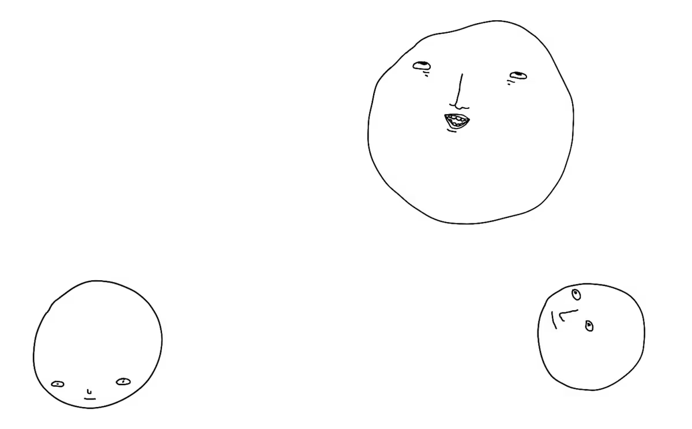

# 433

433 is a font that masks the visible text and replaces it with dots. I'm using it with the Coffeeshop Mode in [Ensō](https://enso.sonnet.io).

Read more about it [here](https://untested.sonnet.io/notes/433-how-to-make-a-font-that-says-nothing/)



## Requirements

- Python 3.8+
- FontForge (system dependency)

## Setting up FontForge

Visit [the official FontForge site](https://fontforge.org/en-US/downloads/).

## Running the command

```bash
# With default options
python3 generate-font.py

# With custom options
python3 generate-font.py --css-output dist/filename.css --font-output=otherfolder/font.woff2 --css-font-src=../otherfolder/font.woff2
```

### Options

- `--css-output` - CSS file output path (default: `dist/css/433.css`)
- `--font-output` - Font file output path (default: `dist/fonts/433.woff2`) 
- `--css-font-src` - Font URL to use in CSS @font-face src (default: `/fonts/433.woff2`)
